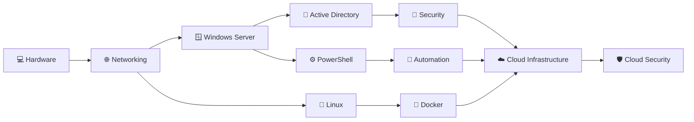

<div align="center">

# 👋 Hi, I'm Samiksha Jagtap

### `IT Infrastructure` • `Windows Server` • `Networking` • `Linux` • `Cloud & Security`


<br>


</div>

---

## 🧑‍💻 About Me

```text
Name        : Samiksha Jagtap
Role        : Technical Support Engineer
Location    : Nashik, Maharashtra, India
Education   : B.Tech - Cloud Technology & Information Security
Focus       : IT Infrastructure → Cloud → Security
Mindset     : Learn • Build • Break • Troubleshoot • Improve
````

I am an **entry-level IT Infrastructure professional** with hands-on training and
practical lab experience in **Windows Server, Networking, Linux, Virtualization
and System Administration**.

Currently working as a **Technical Support Engineer**, while continuously
building deeper skills in infrastructure, cloud and security.

My approach is simple:

> **Don't just learn the technology. Build it, break it, troubleshoot it and understand why it works.**

---

# 🏗️ My Infrastructure Journey



### My current direction

**Infrastructure → Cloud → Security**

---

# 🛠️ Technical Skills

### 🪟 Windows Server


* Windows Server 2019 / 2022
* Active Directory & Domain Services
* User administration
* Group Policy
* Local Policies
* DNS & DHCP
* Windows Firewall
* Server roles & features
* Web Server / Website Hosting
* FTP
* Backup & Recovery
* PowerShell
* Server hardening
* Task scheduling

---

### 🌐 Networking


```text
TCP/IP
IP Addressing
LAN
DHCP
VLAN
ACL
NAT
Routing & Switching
Network Troubleshooting
Wireless Networking
```

---

### 🐧 Linux


```text
RHEL Installation
Users & Groups
Permissions
ACL
IPv4 / IPv6
Storage
Services
Firewall
Logs
SSH
DNS
FTP
NFS
Samba
HTTP / Virtual Hosting
Docker
```

---

### 🖥️ Virtualization & Infrastructure


```text
VMware
VirtualBox
Windows Server Virtual Labs
Linux Virtual Labs
Server-to-Client Mapping
Infrastructure Testing
```

---

# 🚀 Featured Project

## 🏢 Windows Server Enterprise Domain & Services Lab

> A practical enterprise-style Windows Server environment built to understand
> server deployment, domain administration, networking, security and services.

### 🔧 Environment

```text
                 ┌──────────────────────────┐
                 │     Windows Server       │
                 │       2019 / 2022        │
                 └────────────┬─────────────┘
                              │
             ┌────────────────┼────────────────┐
             │                │                │
             ▼                ▼                ▼
      Active Directory       DNS              DHCP
             │                │                │
             └────────────────┼────────────────┘
                              │
                              ▼
                     ┌────────────────┐
                     │ Windows Client │
                     └───────┬────────┘
                             │
                 ┌───────────┼───────────┐
                 ▼           ▼           ▼
              Policies    File Share   Services
                 │
                 ▼
              Security
```

### Implemented / Practiced

* ✅ Windows Server 2019/2022 deployment
* ✅ Active Directory
* ✅ Domain Services
* ✅ User lifecycle administration
* ✅ Group Policy
* ✅ Local Policies
* ✅ DNS
* ✅ DHCP
* ✅ IP configuration
* ✅ Windows Firewall
* ✅ Server hardening
* ✅ Web Server
* ✅ FTP
* ✅ Network Load Balancing concepts
* ✅ PDC / CDC / RODC concepts
* ✅ File and drive mapping
* ✅ Backup & Recovery
* ✅ PowerShell
* ✅ Automation
* ✅ Task Scheduling
* ✅ VMware / VirtualBox

---

# 🧪 My Lab Philosophy

```text
             ┌───────────────┐
             │  Learn Theory │
             └───────┬───────┘
                     ↓
             ┌───────────────┐
             │  Build a Lab  │
             └───────┬───────┘
                     ↓
             ┌───────────────┐
             │ Break Things  │
             └───────┬───────┘
                     ↓
             ┌───────────────┐
             │ Troubleshoot  │
             └───────┬───────┘
                     ↓
             ┌───────────────┐
             │ Document Fix  │
             └───────┬───────┘
                     ↓
             ┌───────────────┐
             │     Repeat    │
             └───────────────┘
```

I believe practical troubleshooting is one of the most important skills in
IT infrastructure.

---

# 🎓 Education

### 🎓 B.Tech — Cloud Technology & Information Security

**Sandip University**

`August 2022 – June 2026`

---

# 💼 Professional Experience

### Technical Support Engineer

**Bits and Bytes Services**

`May 2026 – Present`

📍 Nashik, Maharashtra, India

---

# 📚 Professional Training

```text
MCSA / Windows Server Administration
CCNA
Networking
Red Hat Linux
Hardware & IT Support
```

> Training programs are listed as learning/training experience rather than
> formal vendor certifications unless officially certified.

---

# 📊 GitHub Activity

<div align="center">


</div>

---

# 📈 Contribution Streak

<div align="center">


</div>

---

# 🔐 Infrastructure Mindset

```text
Servers
   ↓
Operating Systems
   ↓
Networks
   ↓
Identity & Access
   ↓
Services
   ↓
Security
   ↓
Automation
   ↓
Cloud
```

Understanding the foundation makes it easier to understand the cloud.

That's the direction I'm following.

---

# 🎯 Current Focus

```yaml
Learning:
  - Windows Server Administration
  - Networking & CCNA
  - Linux Administration
  - PowerShell
  - Virtualization
  - Cloud Infrastructure
  - Infrastructure Security

Career_Path:
  - IT Infrastructure
  - System Administration
  - Network Support
  - Cloud Operations
  - Cloud Security
```

---

# 🌱 2026 → Next Level

```text
[████████████████░░░░] Infrastructure
[██████████████░░░░░░] Networking
[████████████░░░░░░░░] Linux
[████████████░░░░░░░░] Windows Server
[██████████░░░░░░░░░░] Virtualization
[████████░░░░░░░░░░░░] Cloud
[██████░░░░░░░░░░░░░░] Security
```

> The goal isn't to know everything.
> **The goal is to become better every day.**

---

# 🤝 Connect With Me

<div align="center">

<a href="https://www.linkedin.com/in/samiksha-jagtap-44b137309">

</a>

<a href="mailto:samikshajagtap7020@gmail.com">

</a>

</div>

---

<div align="center">

### 💻 Build. Break. Fix. Learn. Repeat.

**Infrastructure today. Cloud tomorrow. Security always.**

⭐ *Thanks for visiting my GitHub profile!*

</div>
